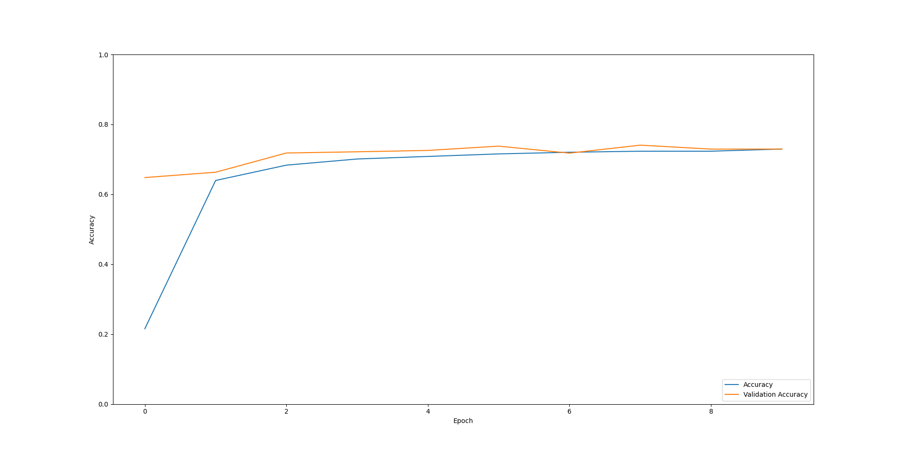
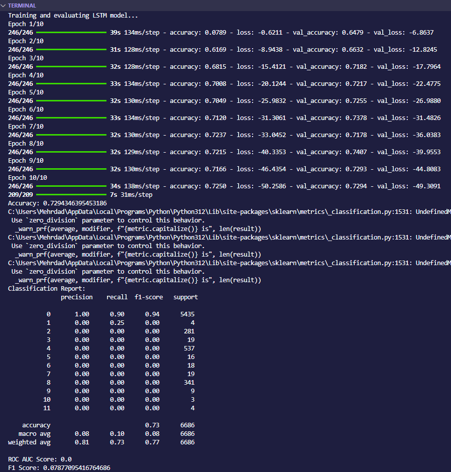
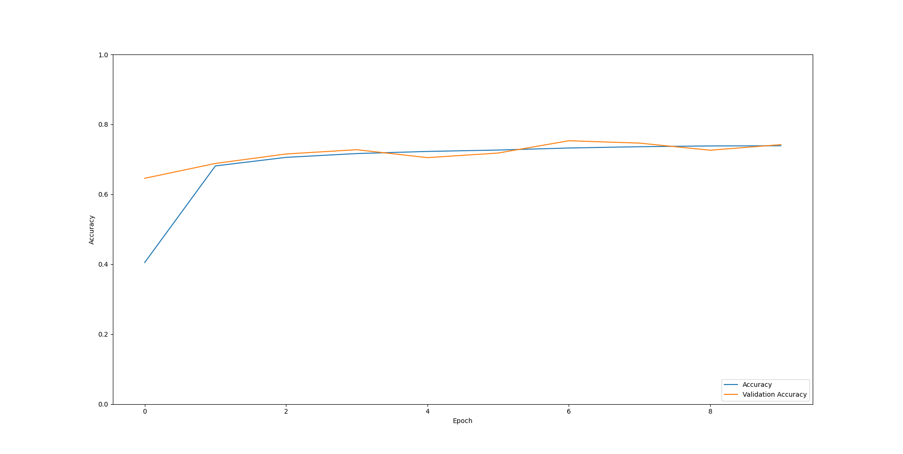
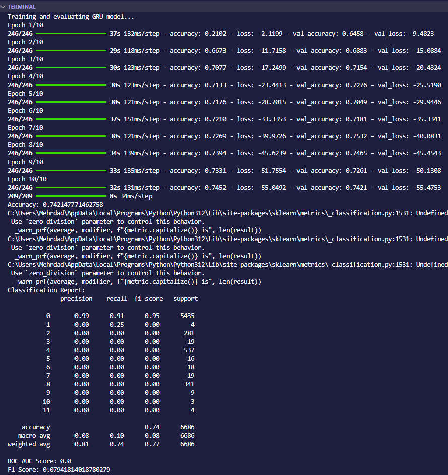
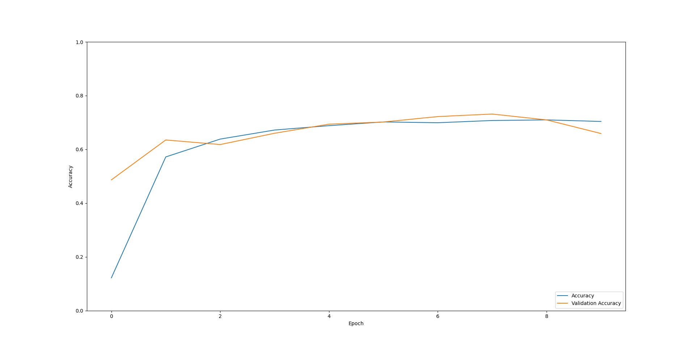
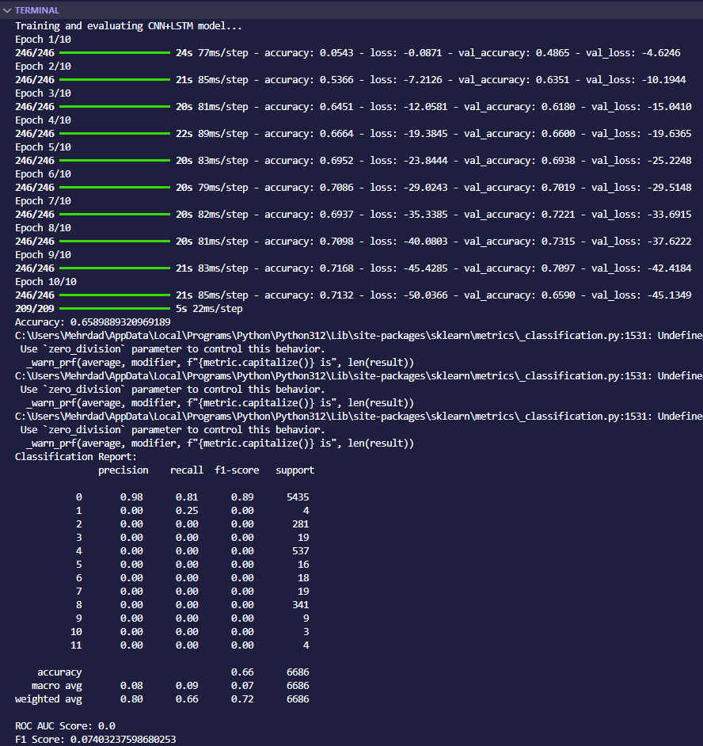
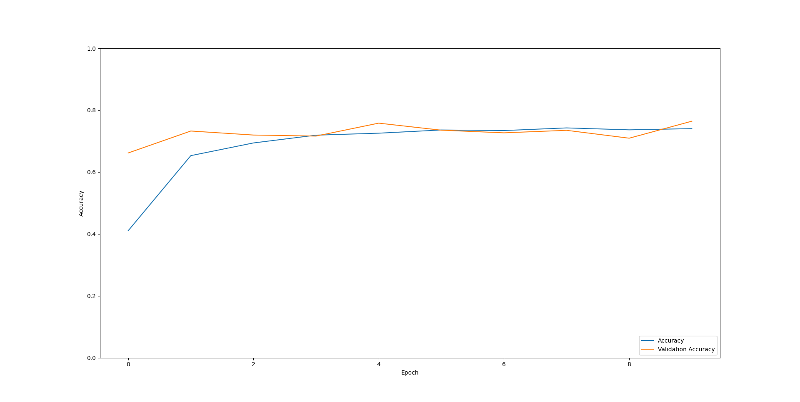
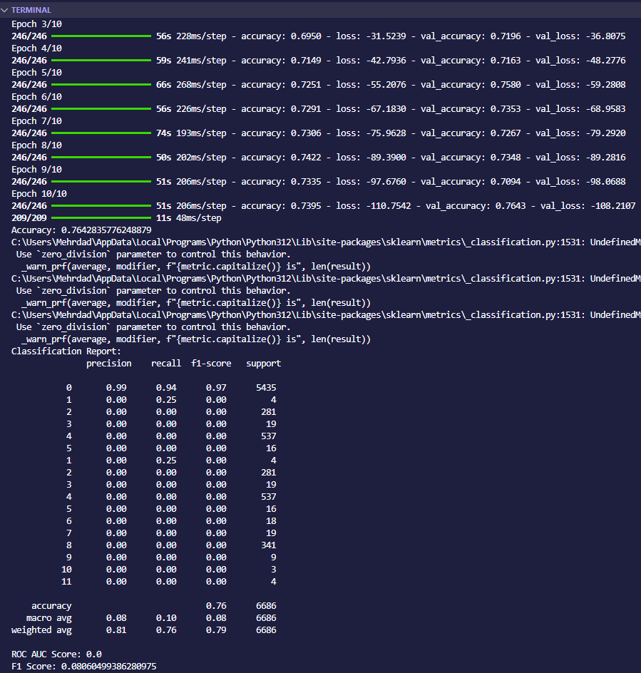

# Intrusion Detection Models 🚀


---

### 📍 Introduction
This project provides a Python-based **network intrusion detection system** built with multiple deep learning models, enabling comprehensive analysis and performance comparison. The supported models include:

- LSTM
- GRU
- CNN-LSTM
- BiLSTM

These models are applied to time-series data, with steps for extracting, preprocessing, and transforming datasets. Evaluation metrics are provided to gauge each model’s effectiveness.

---

## 📑 Features
- **Automatic Library Installation**: Installs necessary Python libraries from `requirements.txt`.
- **Data Extraction and Preprocessing**: Extracts CSV files from a multi-part ZIP archive, cleans data, scales features, and compiles them into a unified dataset.
- **Time-Series Data Preparation**: Transforms the data for time-series analysis compatible with each model.
- **Deep Learning Models**: Implements LSTM, GRU, CNN-LSTM, and BiLSTM to allow comparative analysis.
- **Model Evaluation**: Outputs accuracy, classification reports, ROC AUC, and F1 scores for each model.

---

## 📦 Installation

### Step-by-Step Setup:

1. **Clone the Repository**  
   ```bash
   git clone https://github.com/mehrdadmb2/IntrusionDetectionModels.git
   cd IntrusionDetectionModels
   ```

2. **Path Updates**  
   Update all paths for input and output files to match your system’s directory structure, especially when using large datasets like `CICIDS 2017`.

3. **Install Required Libraries**  
   Ensure `requirements.txt` is in the `IOT/HW3/For Me/` directory and install dependencies by running:
   ```bash
   python intrusion_detection.py
   ```

4. **Download and Prepare the CICIDS 2017 Dataset**  
   The dataset has been divided into seven ZIP files for easier handling and upload on GitHub. Combine all seven files into a single ZIP file named `CICIDS 2017.zip` within `IOT/HW3/For Me/` before running the program.

5. **Python Version Compatibility**  
   Use **Python 3.12** to avoid compatibility issues, as some libraries are not yet supported in Python 3.13.

---

## 🚀 Running the Project

To run the project, execute:
```bash
python intrusion_detection.py
```

---

## 🛠 Project Structure

- **intrusion_detection.py**: This main script orchestrates the following operations:
  - Library installation
  - Data extraction and merging of CSV files
  - Data preprocessing (NaN value handling, scaling)
  - Model training and evaluation

---

## 📊 Model Overview and Results

Due to resource constraints, the results presented are based on **0.8% of the original dataset**, randomly sampled. These results give an indicative performance overview but may not represent full-scale accuracy.

<!--| Model      | Accuracy | Diagrams                                                   |
|------------|----------|------------------------------------------------------------|
| **LSTM**   | 0.7294   | ,  |
| **GRU**    | 0.7421   | ,  |
| **CNN-LSTM** | 0.6589 | ,  |
| **BiLSTM** | 0.7642   | ,  |-->

| Model      | Accuracy | Diagrams                                                   |
|------------|----------|------------------------------------------------------------|
| **LSTM**   | 0.7294   | ,  |
| **GRU**    | 0.7421   | ,  |
| **CNN-LSTM** | 0.6589 | ,  |
| **BiLSTM** | 0.7642   | ,  |

### Model Comparison
The models reveal the following insights:
- **BiLSTM** has the highest accuracy of **0.7642**, indicating superior performance on this subset.
- **GRU** and **LSTM** demonstrate close and effective results, well-suited for capturing temporal dependencies.
- **CNN-LSTM**, while designed to leverage both spatial and temporal patterns, has lower accuracy in this setup, possibly due to the limited subset size.

Running on the full dataset is recommended for more representative comparisons.

---

## 🧩 Helper Functions

The project includes the following helper functions:

- **install_requirements**: Installs required libraries from `requirements.txt`.
- **extract_and_combine_csv**: Extracts and combines CSV files from a ZIP archive.
- **preprocess_data**: Cleans and scales data for model readiness.
- **create_time_series**: Converts data to sequences for time-series models.
- **train_and_evaluate_model**: Trains and evaluates each model, providing performance metrics and plots.

---

## 📄 License

This project is licensed under the MIT License. See the [LICENSE](LICENSE) file for more information.

## 🙋 Support

For any issues or questions, please open an [issue](https://github.com/mehrdadmb2/IntrusionDetectionModels/issues) on GitHub or contact me at [game.developer.mb@gmail.com](mailto:game.developer.mb@gmail.com).

---

### 🌟 Acknowledgments

Special thanks to [Mehrdad](https://github.com/mehrdadmb2) for developing this project and sharing it with the community!

---
